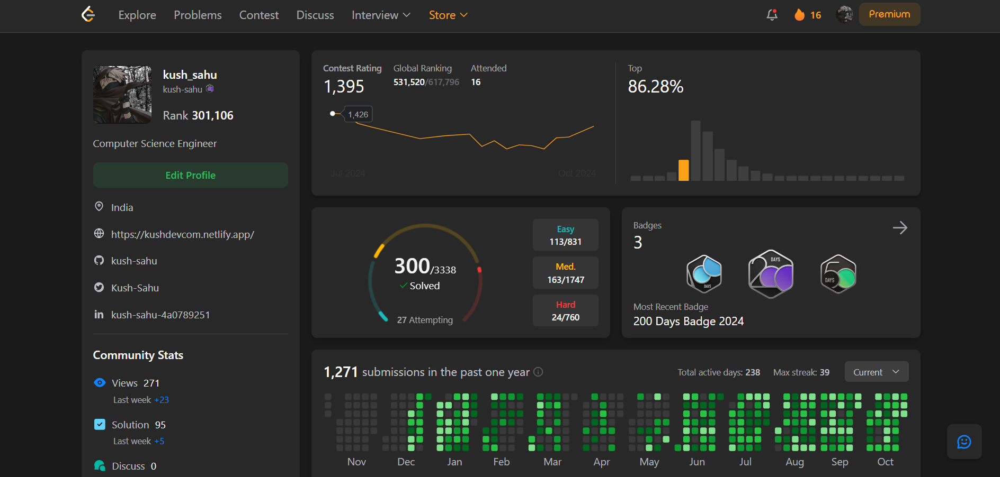

## LeetCode Solutions by Kush Sahu

Welcome to my LeetCode solutions repository! This collection showcases my dedication to solving algorithmic and data structure challenges on LeetCode.

## About Me
I’m committed to continuous problem-solving and learning. Here, you'll find solutions to **300+ questions** on LeetCode, covering a variety of topics such as arrays, strings, dynamic programming, linked lists, and more. I’m actively solving and enhancing my skills through consistent practice.

## Key Highlights
- **Total Questions Solved**: 300+
- **Problem Coverage**: Beginner to Advanced
- **Consistency**: Regular practice to stay sharp and improve efficiency
- **Languages Used**: Primarily JavaScript and Python

## Repository Structure
Each solution is organized by category and difficulty level for easy navigation. I’ve also included explanations and code comments to make my thought process clear.

---

Feel free to replace `"(https://leetcode.com/u/kush-sahu/)"` with the actual URL of your LeetCode profile image. You can expand on the sections to include more details if you'd like. Let me know if there’s anything specific you want to adjust!
